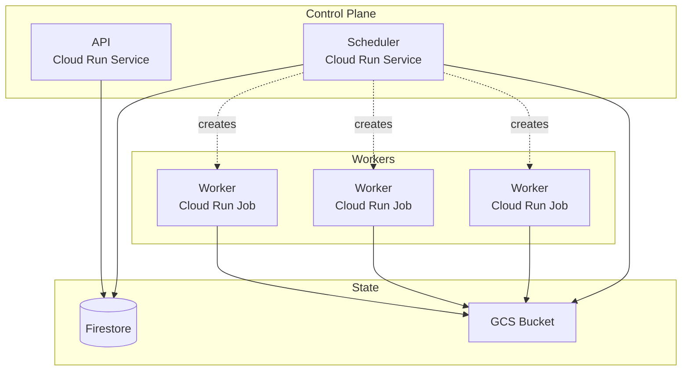

Status: Pending Review

# GCP: Near-Zero Cost Deployment

Serverless deployment using Cloud Run, Firestore, and GCS. All components scale to zero when idle.

## Architecture



**Idle cost**: ~$0 (all components scale to zero)

**When to use**: Default choice for most teams. Minimal cost when workflows aren't running.

## What Gets Deployed

**By infra team (Terraform, one-time + occasional updates):**
- Firestore database
- GCS bucket
- Artifact Registry
- Service accounts + IAM
- VPC connectors (optional, for network isolation)
- Ork scheduler (Cloud Run service)
- Ork API (Cloud Run service)
- Worker configs (`workers.yaml` in GCS)
- Code locations (`locations.yaml` in GCS)

**By data engineers (ongoing):**
- Workflow images pushed to Artifact Registry
- Ork discovers workflows automatically via code locations

## Security Models

### Shared Permissions

Single worker service account with broad permissions across GCS and BigQuery. All tasks run with the same permissions.

**Use when:** Small team, low-security requirements, simple permission model.

**Permissions:**
- Ork Worker: `storage.objectAdmin`, `bigquery.dataEditor`, `bigquery.jobUser`
- Ork Scheduler: `datastore.user`, `run.developer`, `storage.objectAdmin` (ork bucket)

See [`/examples/deployments/gcp-shared-permissions/`](/examples/deployments/gcp-shared-permissions/) for complete Terraform setup.

### ELT Isolated Permissions

Three worker service accounts with minimal permissions each. Extract has internet access, transform is isolated, load bridges GCS to BigQuery.

**Use when:** High-security requirements, need to isolate permissions between pipeline stages.

**Permissions:**
- Extract Worker: `storage.objectCreator` (raw bucket only)
- Transform Worker: `bigquery.dataEditor`, `bigquery.jobUser` (no GCS, no internet)
- Load Worker: `storage.objectViewer` (raw bucket), `bigquery.dataEditor`, `bigquery.jobUser`

**Network isolation:**
- External VPC connector (with internet) for extract workers
- Internal VPC connector (egress blocked) for transform workers

See [`/examples/deployments/gcp-elt-isolated/`](/examples/deployments/gcp-elt-isolated/) for complete Terraform setup.

## Worker Configuration

Tasks reference worker configs by name in `workers.yaml`:

```yaml
workers:
  extract:
    service_account: ork-extract@my-project.iam.gserviceaccount.com
    vpc_connector: projects/my-project/locations/us-central1/connectors/external
    cpu: 1
    memory: 2Gi
    timeout: 3600

  transform:
    service_account: ork-transform@my-project.iam.gserviceaccount.com
    vpc_connector: projects/my-project/locations/us-central1/connectors/internal
    cpu: 2
    memory: 4Gi
    timeout: 7200

default: extract
```

Workflows reference workers:

```yaml
tasks:
  extract:
    worker: extract
    executor: python
    file: tasks/extract.py

  transform:
    worker: transform
    executor: bigquery
    config_file: sql/transform.yaml
    depends_on: [extract]
```

## Updating Configuration

To update worker configs or code locations:

1. Edit `workers.yaml` or `locations.yaml`
2. Run `terraform apply`
3. Scheduler restarts and picks up new config
