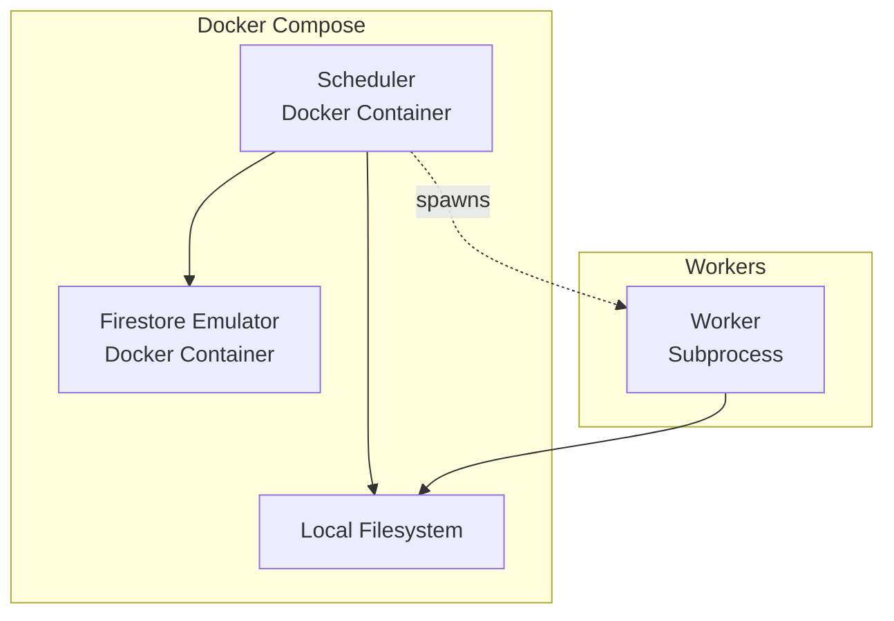

Status: Pending Review

# Local Development

Run Ork locally using Docker Compose and the Firestore emulator.

## Architecture



Workers run as subprocesses in local mode, not as separate containers.

## Setup

See [`/examples/deployment/local/`](/examples/deployment/local/) for complete docker-compose setup.

The setup includes:
- Firestore emulator (replaces cloud Firestore)
- Ork scheduler (runs in subprocess executor mode)
- Worker configs and code locations

## Usage

```bash
cd examples/deployment/local
docker compose up -d
ork workflow deploy workflows/etl.yaml
ork run start my_etl
ork run logs my_etl --follow
docker compose down
```
