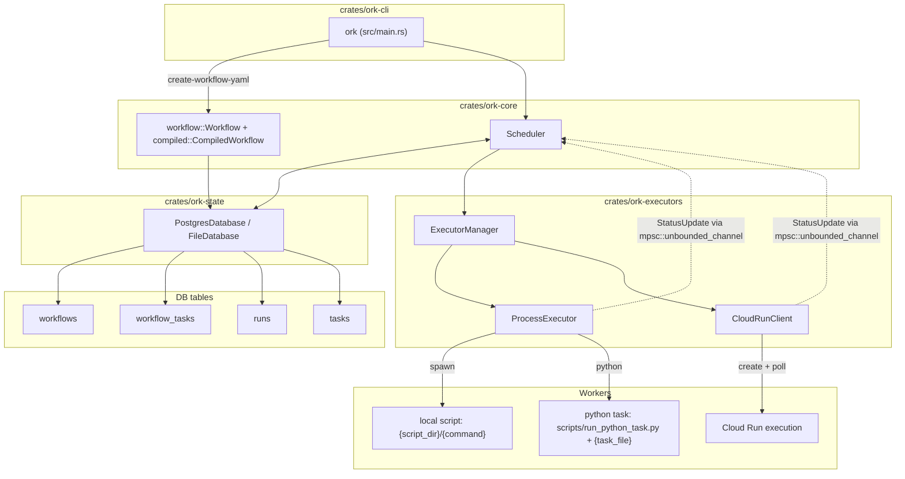
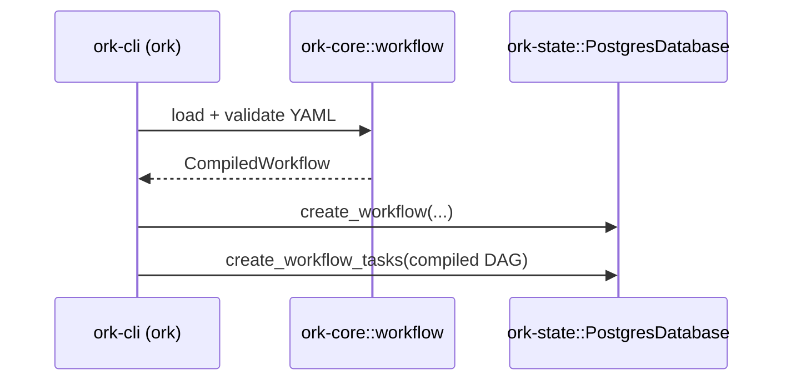
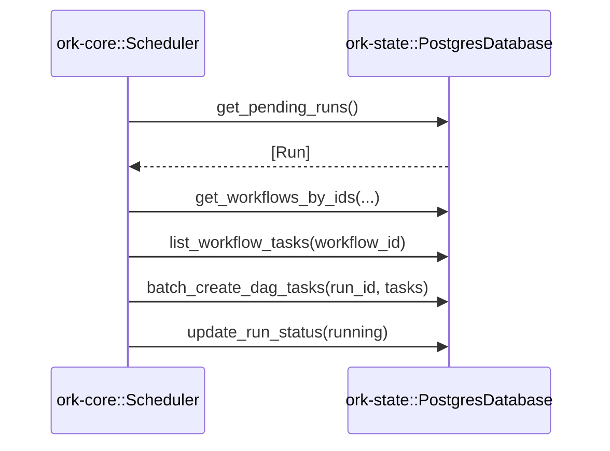
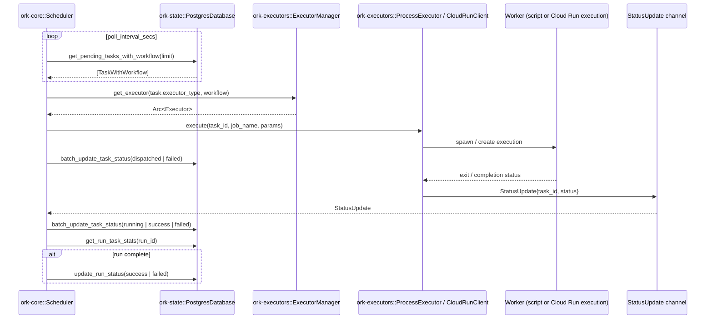

# Architecture

Ork is a workflow orchestrator with DAGs compiled up front and stored in the database. This page uses concrete Ork names so the diagrams map directly to code.

## Components (Ork names)

## Component Responsibilities

| Component | Role |
|-----------|------|
| [ork-cli (ork)](crates/ork-cli.md) | Defines workflows, compiles YAML DAGs, starts the scheduler loop |
| [ork-core::Scheduler](../../crates/ork-core/src/scheduler.rs) | Main loop: finds pending runs/tasks, dispatches work, processes `StatusUpdate`s |
| [ork-core::workflow + compiled](../../crates/ork-core/src/workflow.rs) | YAML workflow definition + compilation into DAG tasks |
| [ork-core::Database (trait)](../../crates/ork-core/src/database.rs) | Storage contract for runs/tasks/workflows used by Scheduler |
| [ork-state::PostgresDatabase](../../crates/ork-state/src/postgres.rs) | Default Database implementation for production Postgres |
| [ork-state::FileDatabase](../../crates/ork-state/src/file_database.rs) | File-backed Database for local/dev use |
| [ork-executors::ExecutorManager](../../crates/ork-executors/src/manager.rs) | Chooses executor per task and caches backends |
| [ork-executors::ProcessExecutor](../../crates/ork-executors/src/process.rs) | Executes local scripts or Python tasks via [scripts/run_python_task.py](../../scripts/run_python_task.py), reports status |
| [ork-executors::CloudRunClient](../../crates/ork-executors/src/cloud_run.rs) | Creates and polls Cloud Run executions, reports status |
| [ork-runner::LocalScheduler (legacy)](../../crates/ork-runner/src/scheduler.rs) | Old scheduler used by ork-web; pending migration |
| [ork-web (legacy)](crates/ork-web.md) | Axum UI/API built on ork-runner |

## Data Flow

### Workflow Definition Flow (YAML -> DB)

### Run Creation Flow (Scheduler)

### Task Execution Flow (Per-task executors)

## Key Design Decisions (mapped to code)

- **Compile DAGs up front**: [`create-workflow-yaml`](../../crates/ork-cli/src/main.rs) compiles YAML into `workflow_tasks` rows.
- **Per-task executors**: [`Task.executor_type`](../../crates/ork-core/src/models.rs) drives backend selection per task.
- **Event-driven updates**: [`ork-core::Scheduler`](../../crates/ork-core/src/scheduler.rs) listens on an `mpsc::unbounded_channel` for `StatusUpdate`s.
- **Batch DB ops**: [`ork-state::PostgresDatabase`](../../crates/ork-state/src/postgres.rs) implements batch create/update to reduce round trips.
- **Bounded concurrency**: dispatch uses `buffer_unordered` controlled by [`OrchestratorConfig`](../../crates/ork-core/src/config.rs).

## Current Limitations

- No retry logic (tasks fail permanently)
- No timeout handling (tasks can run indefinitely)
- No heartbeat monitoring (hung tasks are not detected)
- No output passing between tasks (ordering-only DAGs)
- No scheduled runs (manual trigger only)
