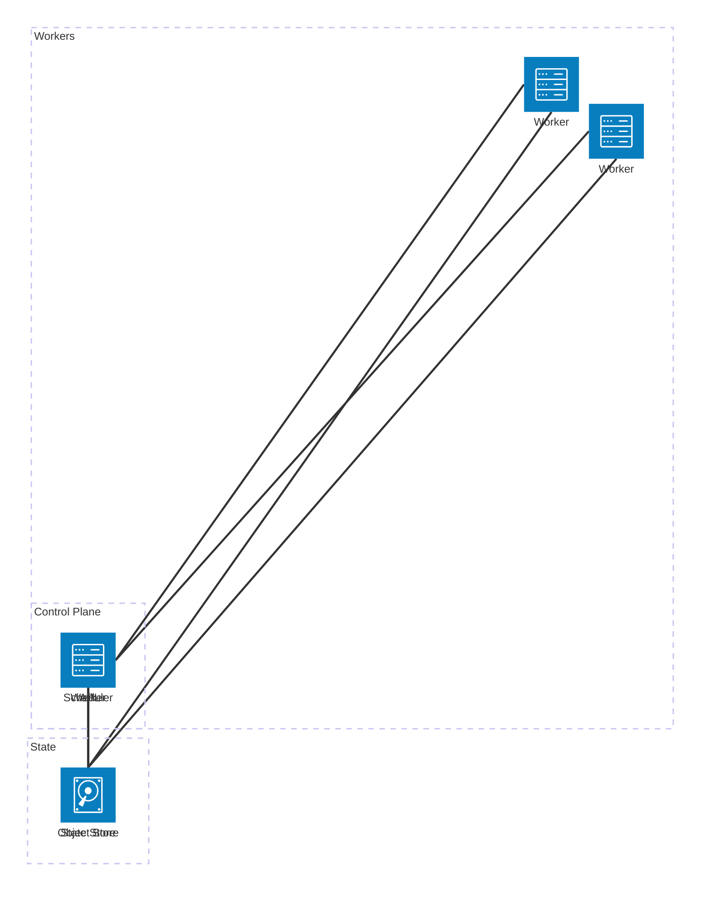
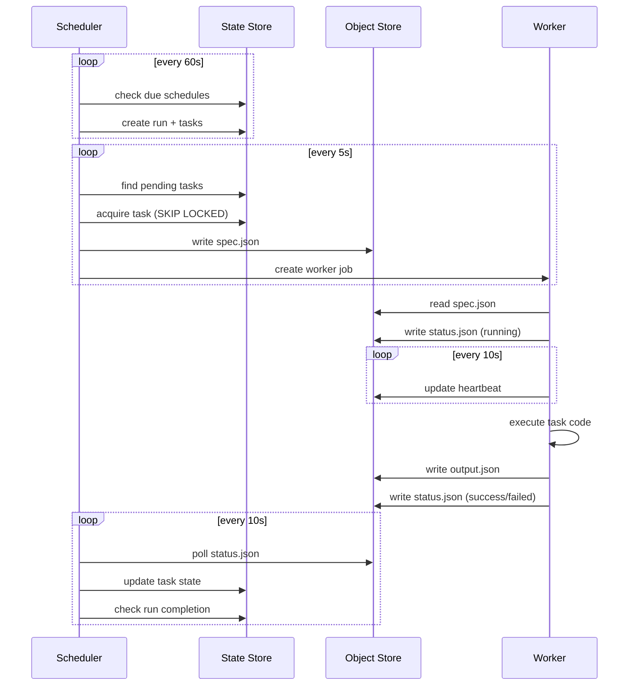
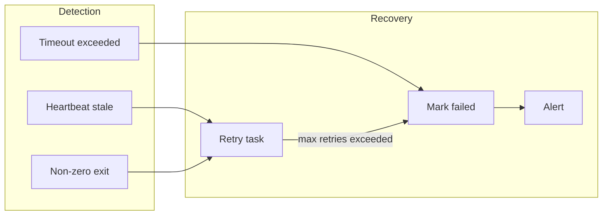

Status: Pending Review

# Architecture

Ork is a serverless workflow orchestrator designed for near-zero idle cost.

## Components

## Component Responsibilities

| Component | Role |
|-----------|------|
| **Scheduler** | Polls for work, dispatches tasks, monitors completion |
| **Worker** | Executes task code, reports status |
| **API** | User interface, manual triggers, scheduler control |
| **State Store** | Workflow definitions, run metadata, schedules, leases |
| **Object Store** | Task specs, status files, outputs |

## Data Flow

## Failure Handling

