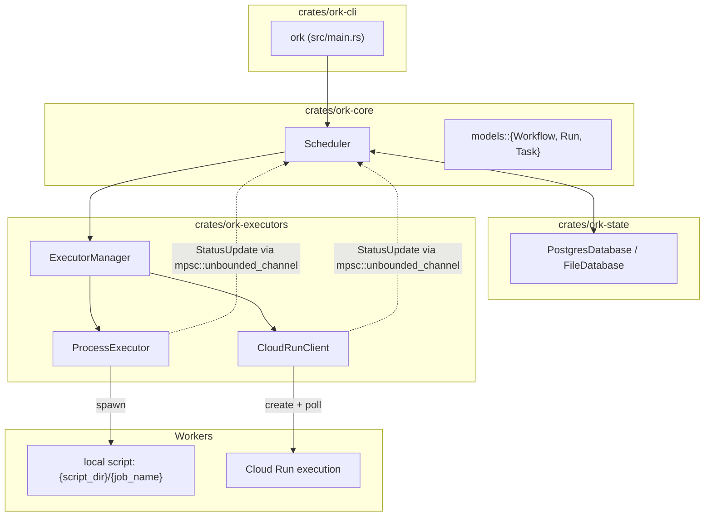
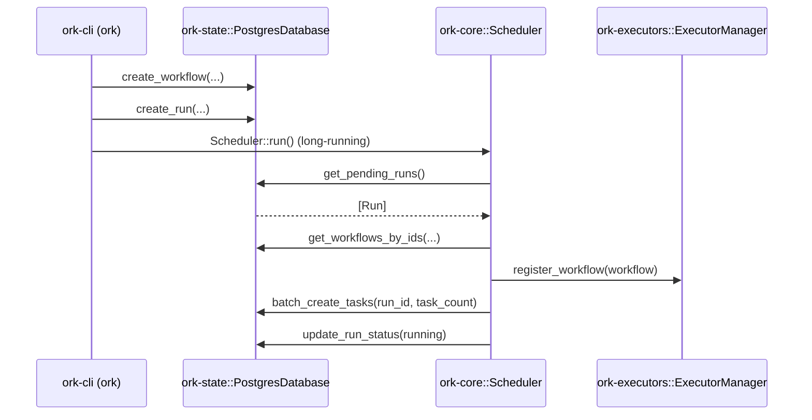
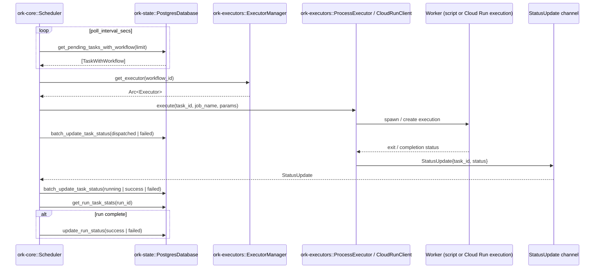

# Architecture

Ork is a workflow orchestrator built from a small set of crates. This page uses concrete Ork names so the diagrams map directly to code.

## Components (Ork names)

## Component Responsibilities

| Component | Role |
|-----------|------|
| [ork-cli (ork)](crates/ork-cli.md) | Starts the scheduler loop, exposes CLI commands, and hosts perf-test tooling | 
| [ork-core::Scheduler](../../crates/ork-core/src/scheduler.rs) | Main loop: finds pending runs/tasks, dispatches work, processes StatusUpdates | 
| [ork-core::Database (trait)](../../crates/ork-core/src/database.rs) | Storage contract for runs/tasks/workflows used by Scheduler | 
| [ork-state::PostgresDatabase](../../crates/ork-state/src/postgres.rs) | Default Database implementation for production Postgres | 
| [ork-state::FileDatabase](../../crates/ork-state/src/file_database.rs) | File-backed Database for local/dev use | 
| [ork-executors::ExecutorManager](../../crates/ork-executors/src/manager.rs) | Maps workflow_id -> executor instance and wires status channels | 
| [ork-executors::ProcessExecutor](../../crates/ork-executors/src/process.rs) | Executes local scripts, reports status via StatusUpdate | 
| [ork-executors::CloudRunClient](../../crates/ork-executors/src/cloud_run.rs) | Creates and polls Cloud Run executions, reports status | 
| [ork-runner::LocalScheduler (legacy)](../../crates/ork-runner/src/scheduler.rs) | Old scheduler used by ork-web; pending migration | 
| [ork-web (legacy)](crates/ork-web.md) | Axum UI/API built on ork-runner | 

## Data Flow

### Run Creation Flow

### Task Execution Flow (Event-Driven)

## Key Design Decisions (mapped to code)

- **Event-driven updates**: [`ork-core::Scheduler`](../../crates/ork-core/src/scheduler.rs) listens on an `mpsc::unbounded_channel` for `StatusUpdate` events from executors.
- **Batch DB ops**: [`ork-state::PostgresDatabase`](../../crates/ork-state/src/postgres.rs) implements batch create/update to reduce round trips.
- **Bounded concurrency**: dispatch uses `buffer_unordered` controlled by [`OrchestratorConfig`](../../crates/ork-core/src/config.rs).
- **Executor isolation**: [`ork-executors::ExecutorManager`](../../crates/ork-executors/src/manager.rs) chooses backend per workflow.

## Current Limitations

- No retry logic (tasks fail permanently)
- No timeout handling (tasks can run indefinitely)
- No heartbeat monitoring (hung tasks are not detected)
- No DAG support (tasks are independent)
- No scheduled runs (manual trigger only)
