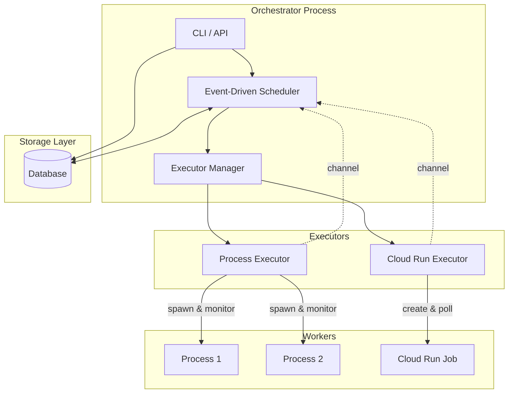
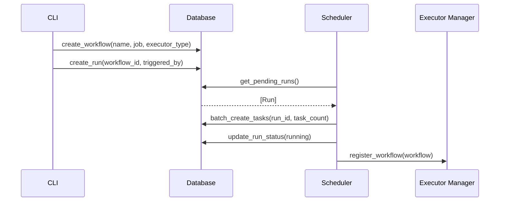
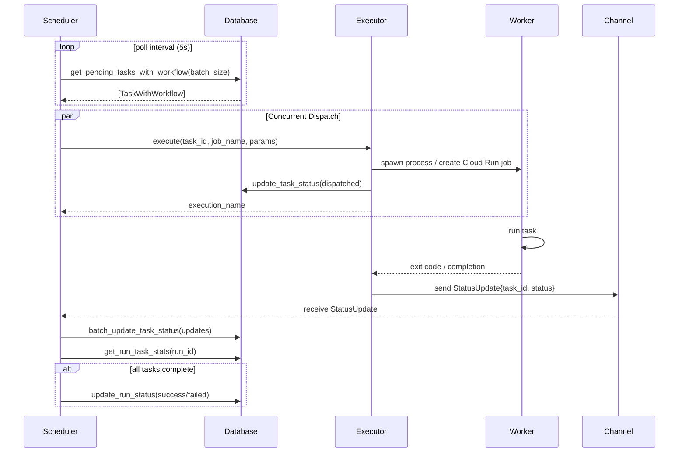

# Architecture

High-performance workflow orchestrator with event-driven scheduler and database-backed state.

## Components

## Component Responsibilities

| Component | Role |
|-----------|------|
| **CLI** | User interface for workflow/run management |
| **Scheduler** | Event-driven task dispatcher, processes status updates via channels |
| **Executor Manager** | Manages executor instances per workflow |
| **Process Executor** | Spawns local processes, monitors via async tasks |
| **Cloud Run Executor** | Creates Cloud Run jobs, polls status |
| **Database** | Stores workflows, runs, tasks (Postgres or SQLite) |

## Data Flow

### Run Creation Flow

### Task Execution Flow (Event-Driven)

## Key Design Decisions

### Event-Driven Architecture
- **Channel-based updates**: Executors push status updates via `mpsc::unbounded_channel`
- **No polling**: Scheduler receives updates immediately when tasks complete
- **Async/await**: All I/O is non-blocking using Tokio runtime

### Database Optimizations
- **JOIN queries**: Single query fetches task + workflow data (not N+1)
- **Batch operations**: `batch_create_tasks`, `batch_update_task_status`
- **Bounded concurrency**: `buffer_unordered(N)` limits parallel dispatches
- **Connection pooling**: sqlx pool reuses database connections

### Performance Characteristics
- **Throughput**: 155+ tasks/sec
- **Latency**: <700ms p99 (task create → complete)
- **Memory**: ~10MB RSS for 500 concurrent tasks
- **Idle cost**: Near-zero when no work pending

## Current Limitations

- No retry logic (tasks fail permanently)
- No timeout handling (tasks can run indefinitely)
- No heartbeat monitoring (can't detect hung tasks)
- No DAG support (tasks run independently)
- No scheduled runs (manual trigger only)
