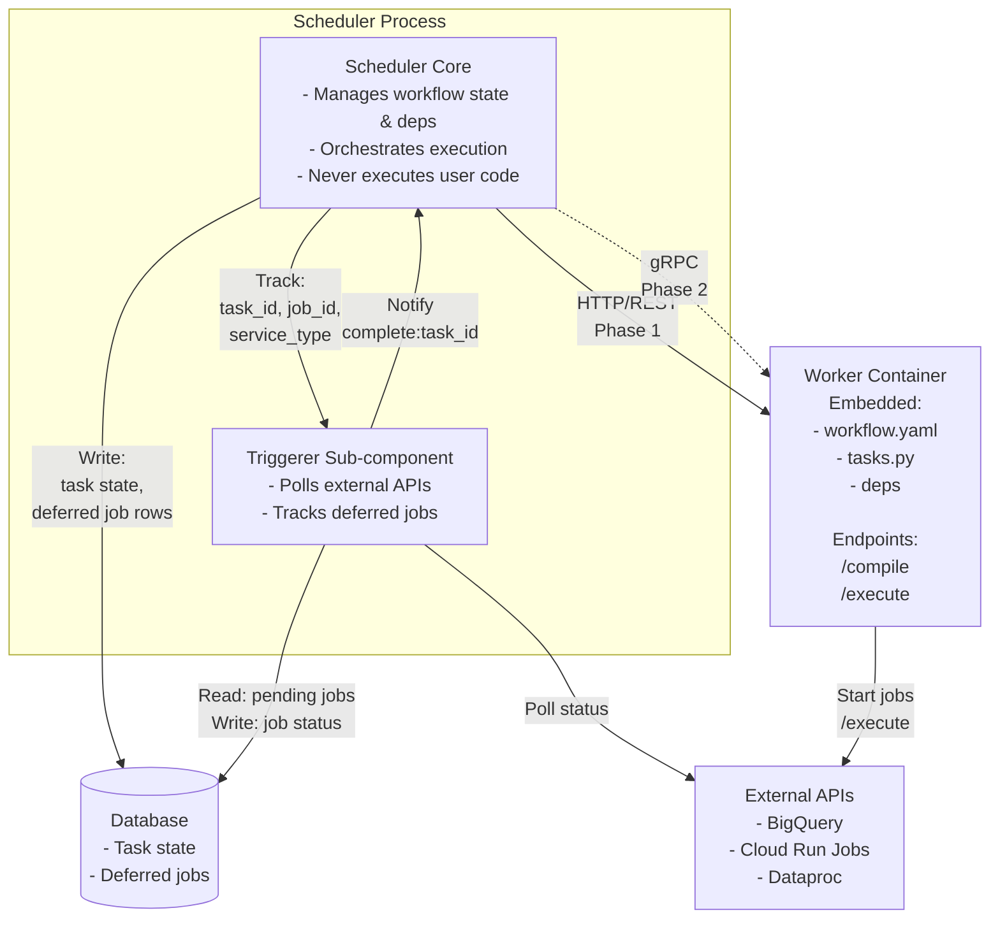
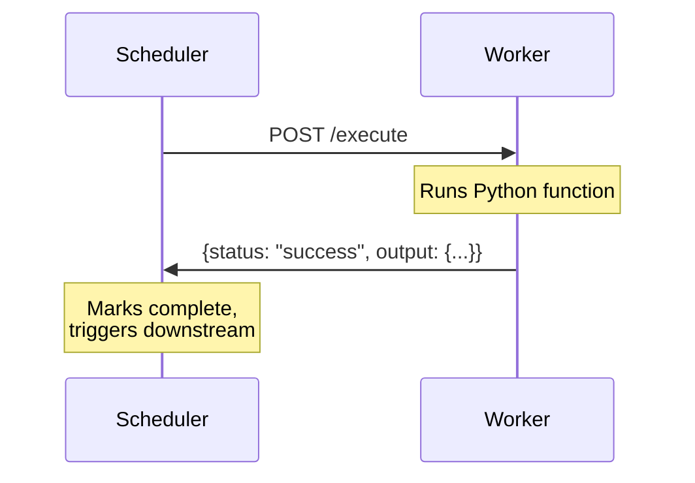
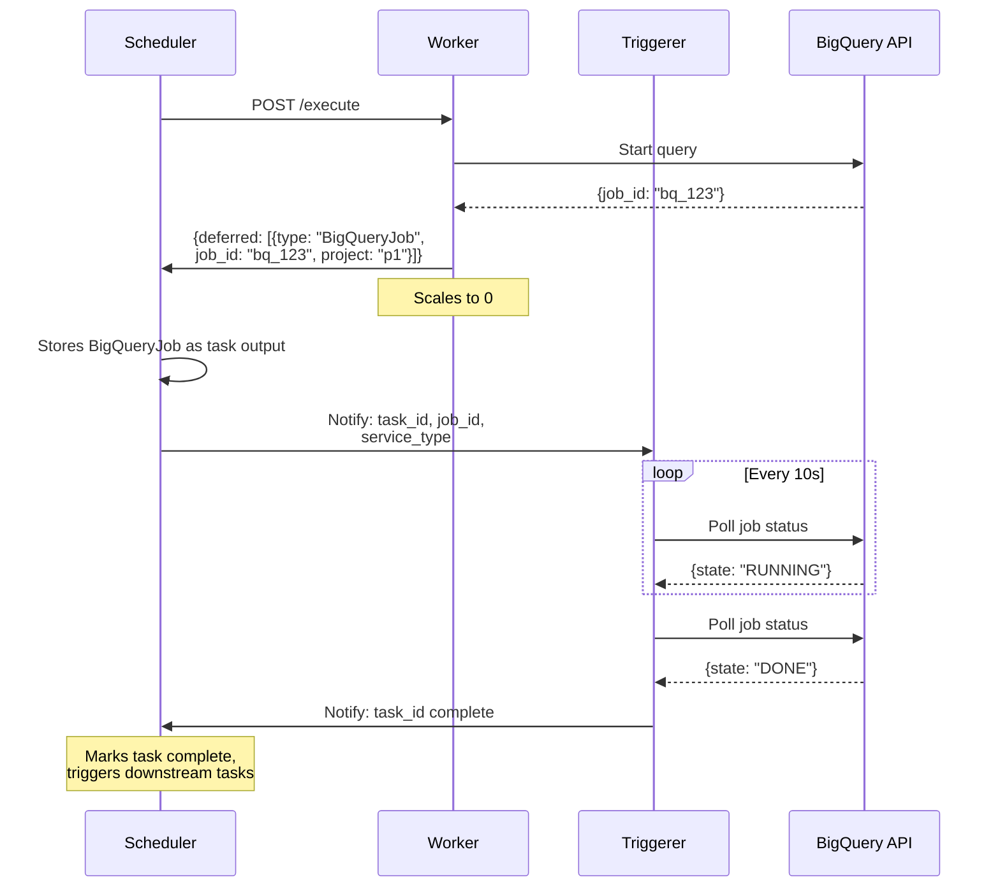

# Ork Worker Architecture

## Problem Statement

Current architecture has user code executing in the scheduler process during both DAG compilation and execution:

**During compilation:**
```rust
// Introspects Python functions to extract signatures
fn introspect_python_signature(path: &Path, func_name: &str) -> Result<Value> {
    let output = Command::new("python3")
        .arg(&script_path)
        .arg(path)
        .arg(func_name)
        .output()?;
}
```

**During execution:**
- Process executor runs user code in scheduler process
- Python executor runs user code in scheduler process

**Why this is a problem:**

1. **Compilation load on scheduler:** User code processing during DAG compilation can cause significant load on the scheduler, making it difficult to add many different projects from separate teams. Each team's compilation workload impacts the shared scheduler.

2. **Inefficient resource usage for long-running jobs:** When execution moves to a separate serverless environment (like Cloud Run), and that container dispatches a long-running job (BigQuery, Dataproc, etc.), the user code container just sits idle waiting for the job to complete. This wastes resources - the container can't scale to 0 while tracking the job.

## Design Goal

Users should be able to deploy their code completely isolated from the main Ork scheduler and executor, into separate containers that come with the Ork SDK/CLI. This system would (normally) scale to 0, and be used to: parse all DAGs and return a compiled result, execute tasks.

- Scheduler doesn't execute user code
- Workers are separate containers with embedded user code + YAML
- Workers can scale to 0 (serverless - Cloud Run, etc.)
- Workers handle: DAG compilation, task execution
- Scheduler handles: orchestration, dependency management

## Architecture



**Communication:** Start with REST/HTTP, migrate to gRPC later for better performance and streaming.

## The Core Idea: Deferrables

Worfklow definition

```yaml
tasks:
  analyze:
    executor: python
    file: tasks.py
    function: analyze_data
```

Python task definition

```python
# tasks.py - User has full control
from ork.deferrables import BigQueryJob
from google.cloud import bigquery
import os

def analyze_data() -> BigQueryJob:
    # User controls: config, env vars, query building, auth, EVERYTHING
    config = read_config_from_yaml()  # Read arbitrary configs
    project = os.getenv("GCP_PROJECT")
    dataset = os.getenv("BQ_DATASET", "analytics")

    # Build query using config + env vars
    query = f"""
        SELECT * FROM `{project}.{dataset}.{config['table_name']}`
        WHERE date >= '{config['start_date']}'
    """

    client = bigquery.Client(project=project)
    job = client.query(query)

    # Return deferrable - tells Ork "track this BigQuery job"
    return BigQueryJob(
        project=project,
        job_id=job.job_id,
        location="US"
    )
```

**Key insight:** Executors are just execution environments (python, process, rust). User code determines sync vs async by what it returns.


**What happens:**
1. Task runs, starts BigQuery job, returns `BigQueryJob` deferrable
2. Worker scales to 0
3. Scheduler tracks job via Triggerer polling BigQuery API
4. Job completes, task marked done
5. Results are in the BigQuery table, downstream tasks can run

**Rare case - Fetching results to process further:**

If you actually need the query results from a long running task, create a second task:

```yaml
tasks:
  run_query:
    executor: python
    function: run_query
    output_type: BigQueryJob

  process_results:
    executor: python
    function: process_results
    input_type:
      job_info: BigQueryJob
    output_type: dict
    depends_on: [run_query]
```

**Key point:** Most deferrable use cases are long-running fire-and-forget ETL/compute jobs. Results stay in tables or blob storage, and you usually don't need the result of the deferrable job itself.

### How Deferrables Work

Deferrables are just types that the scheduler knows how to track:

**Flow:**
1. Task returns a deferrable (e.g., `BigQueryJob`, `CloudRunJob`)
2. Worker serializes it and sends to scheduler
3. Scheduler stores the deferrable info as task output
4. Triggerer polls external API until job completes
5. Task marked as success/failure
6. Downstream tasks can use the deferrable info as input

**Example deferrables:**
- `BigQueryJob` - Scheduler polls BigQuery API
- `CloudRunJob` - Scheduler polls Cloud Run API
- `DataprocJob` - Scheduler polls Dataproc API

### Why Not Executor Types?

**Bad approach (too rigid):**
```yaml
tasks:
  analyze:
    executor: bigquery_job
    query: "SELECT * FROM dataset.table"  # Can't customize!
```

Problem: Users need to read config from YAML, setup project/dataset from env vars, do custom logic in Python, etc. Hardcoded queries immediately break.


## How Deferrables Enable Scale-to-Zero

**The problem:** If a worker container dispatches a long-running job (BigQuery query taking 10 minutes), the container sits idle waiting. Can't scale to 0, wastes resources.

**The solution:**
1. Worker starts the job, returns job ID to scheduler, scales to 0
2. Scheduler tracks the job ID in database
3. Triggerer component polls external API (BigQuery, Cloud Run, etc.)
4. When complete, scheduler marks the task done

Workers are stateless - they don't track anything or poll.

## Worker Responsibilities (Simple & Stateless)

Workers are **stateless**.

**What workers DO:**
1. **Compile DAG** (`POST /compile`)
   - Load embedded workflow YAML
   - Validate, introspect Python signatures
   - Return compiled DAG

2. **Execute task** (`POST /execute`)
   - Run user Python/Rust code
   - If returns normal data → return `{output: ...}`
   - If returns deferrable(s) → return `{deferred: [...]}`
   - Scale to 0 after response

**What workers DON'T do:**
- ❌ Poll external services
- ❌ Track job state
- ❌ Handle retries
- ❌ Maintain any state

The worker mainly compiles the DAG and starts/executes jobs, but does not participate in longer communication with respect to polling the status of jobs (unless users hand-roll that themselves).

## Scheduler Responsibilities (The Hard Part)

Scheduler-based tracking of various systems (Cloud Run Jobs, BigQuery, whatever) should be built-in to Ork, not user code. This is the "hard" problem we want to solve - what the IO-heavy scheduler should do well.

Scheduler owns:
- Job tracking in database
- Polling external APIs (via Triggerer)
- State management
- Retries, log capture, timeouts

State tracking in the DB is critical in case a scheduler dies - all stuff that user code is ill-suited for.

## Execution Flows

### Sync Task



### Async Task (Deferrable)

Example: BigQuery job tracked by scheduler



**Key point:** Scheduler just tracks job to completion. Deferrable info (job_id, project, etc.) is stored as task output. Downstream tasks can use it as input to fetch results.

## Built-in Deferrable Types

**MVP deferrables** (for BigQuery, Cloud Run Job, and other common GCP multi-second operations):
1. `BigQueryJob`
2. `CloudRunJob`
3. `DataprocJob` (Spark/Hadoop jobs)
4. `CustomHttp`

Users return these from their Python/Rust functions:

```python
from ork.deferrables import BigQueryJob, CloudRunJob

def my_task():
    # Start multiple jobs
    bq_job = bq_client.query("SELECT ...")
    cr_job = cloudrun_client.run_job(...)

    # Return both - scheduler tracks ALL of them
    return [
        BigQueryJob(project="p1", job_id=bq_job.job_id),
        CloudRunJob(project="p1", region="us-central1", execution_id=cr_job.name)
    ]
    # Task completes when ALL deferrables complete
```

## Triggerer Component

Sub-component within the scheduler process:

**Scheduler → Triggerer (in-process):**
- When worker returns deferred job: sends `task_id`, `job_id`, `service_type` to triggerer
- Triggerer can also query DB for pending jobs on startup/restart

**Triggerer operations:**
- Uses appropriate JobTracker based on `service_type` (BigQuery, Cloud Run, Dataproc, CustomHttp)
- Polls external APIs concurrently (async Rust/tokio)
- Reads pending jobs from DB, writes status updates

**Triggerer → Scheduler (in-process):**
- When job completes: notifies scheduler with `task_id`
- Scheduler marks task complete, triggers downstream tasks

## Implementation Components

**Scheduler/Triggerer (Rust):**
- JobTracker trait and implementations (BigQuery, Cloud Run, Dataproc, CustomHttp)
- Triggerer polling loop
- Database schema for deferred_jobs
- Worker client for /compile and /execute calls

**Worker (Rust + embedded user code):**
- HTTP server with /compile, /execute endpoints
- Deferrable detection and serialization
- Embedded workflow YAML and user tasks

**Ork SDK (Python/Rust):**
- Deferrable classes (BigQueryJob, CloudRunJob, etc.)
- Helper functions for task definitions
